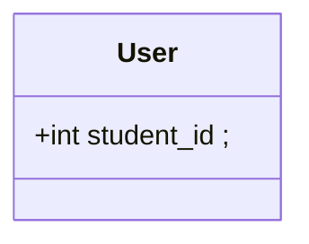

# UML

-----
## User class

```mermaid
classDiagram
    class User{
        +int student_id ;
        
    }
%%    Animal <|-- Duck
%%    Animal <|-- Fish
%%    Animal <|-- Zebra
%%    Animal : +int age
%%    Animal : +String gender
%%    Animal: +isMammal()
%%    Animal: +mate()
%%    class Duck{
%%        +String beakColor
%%        +swim()
%%        +quack()
%%    }
%%    class Fish{
%%        -int sizeInFeet
%%        -canEat()
%%    }
%%    class Zebra{
%%        +bool is_wild
%%        +run()
%%    }
```